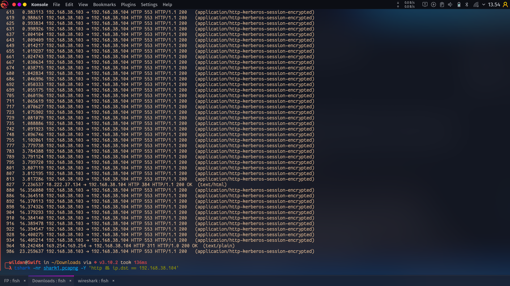
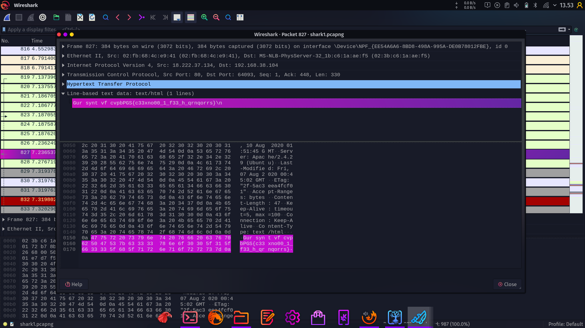
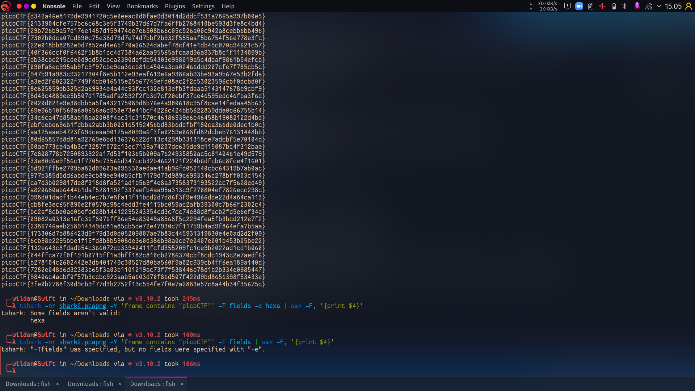
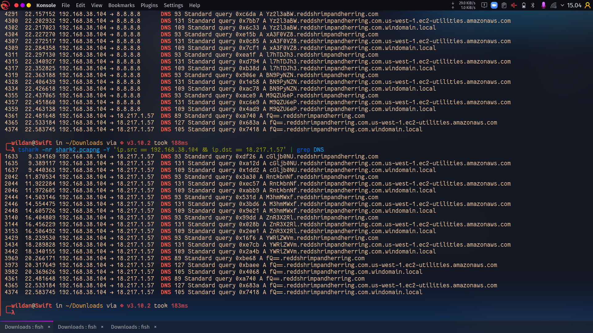

# Jawaban dan How to Solve

Solved -> 14  
Total point -> 1065

1. Obedient Cat **5 pts**

```
- cat flag | xsel -b
- flag -> picoCTF{s4n1ty_v3r1f13d_2fd6ed29}
```

2. Mod 26 **10 pts**

```
- decode ROT13
```

3. Lets Warm Up **50 pts**

```
- Lihat ASCII tabel dengan hexa 70
- Masukkan ke flag -> picoCFT{p}
```

4. what's a net cat? **100 pts**

```
- nc jupiter.challenges.picoctf.org 64287 | grep pico | xsel -b
- Flag -> picoCTF{nEtCat_Mast3ry_284be8f7}
```

5. First Grep **100 pts**

```
- cat file | grep pico | xsel -b
- Flag -> picoCTF{grep_is_good_to_find_things_dba08a45}
```

6. strings it **100 pts**

```
- strings -a strings | grep pico | xsel -b
- flag -> picoCTF{5tRIng5_1T_827aee91}
```

7. Insp3ct0r **50 pts**

```
- Inspect element agar bisa melihat html dan script js nya
- Untuk css nya tinggal akses melalui /mycss.css
- Lalu urutkan HTML -> CSS -> JS menjadi picoCTF{tru3_d3t3ct1ve_0r_ju5t_lucky?832b0699}
```

8. Glitch Cat **100 pts**

```
- nc saturn.picoctf.net 52680 >> temp.py
- masukkan ke perintah 'print()'
- flag -> picoCTF{gl17ch_m3_n07_bda68f75}
```

9. PW Crack 1 **100 pts**

```
- Melihat source code level1.py pada fungsi level_1_pw_check()
- Masukkan password nya
- flag -> picoCTF{545h_r1ng1ng_ccbfafcb}
```

10. PW Crack 2 **100 pts**

```
- Melihat source code level2.py
- Pada fungsi level_2_pw_check(), dicocokkan antara user input dengan yang ada di source code
- print password dari source code melalui python
- flag -> picoCTF{tr45h_51ng1ng_a3e28409}
```

11. PW Crack 5 **100 pts**

```
- Melihat source code level5.py
- Bruteforece password dengan kemungkinan password yang ada di dictionary.txt
- flag -> picoCTF{h45h_sl1ng1ng_492b0b61}
```

12. Serpentine **100 pts**

```
- micro serpentine.py
- print_flag(); return
- flag -> picoCTF{7h3_r04d_l355_7r4v3l3d_ae0b80bd}
```
13. Wireshark doo dooo do doo... **100 pts**
- Pertama saya lihat dulu di wireshark, dan saya anggap 192.168.38.104 sebagai client yang meminta flag kepada server
- Lalu saya cari response dari server dengan command 
`tshark -nr shark1.pcapng -Y 'http && ip.dst == 192.168.38.104'` 

- Lalu saya menemukan sesuatu yang beda dari yang lain yaitu pada nomer 827 dan 964
- Lalu saya cek lagi menggunakan wireshark  

- Dan saya menemukan hal mirip flag disana, yaitu `cvpbPGS{c33xno00_1_f33_h_qrnqorrs}`
- Dan saya pikir 'cvpb' itu jika di-decode harus menjadi 'pico', jadi dia di-mundurkan sebanyak 13 yaitu dari c ke p dst..
- Setelah saya melihat di internet ternyata itu adalah ROT13, jadi saya cari ROT13 decoder lalu men-decode nya
- Dan didapat flag -> picoCTF{p33kab00_1_s33_u_deadbeef}
14. Wireshark twoo twooo two twoo... **100 pts**


- Pertama saya mencoba beberapa flag dari perintah
`tshark -nr shark2.pcapng -Y 'frame contains "picoCTF"' -T fields -e text | awk -F, '{print $4}' `  

ternyata tidak ada yang bisa
- Lalu saya cari lagi dan lagi.. dan akhirnya saya menemukan sesuatu di komunikasi dengan DNS nya   
`tshark -nr shark2.pcapng -Y 'ip.src == 192.168.38.104 && ip.dst == 18.217.1.57' | grep DNS  ` 

- Disana ada sesuatu mirip hasil encode dari base64, diawali dari 'cGljb0NU' dan diakhiri dengan 'fQ=='  
- Lalu saya rangkai hingga menjadi cGljb0NURntkbnNfM3hmMWxfZnR3X2RlYWRiZWVmfQ==  
- Dan saya decode dengan `echo "cGljb0NURntkbnNfM3hmMWxfZnR3X2RlYWRiZWVmfQ==" >> temp2.txt && base64 -d temp2.txt && rm temp2.txt`
- Lalu didapat flag -> picoCTF{dns_3xf1l_ftw_deadbeef}

